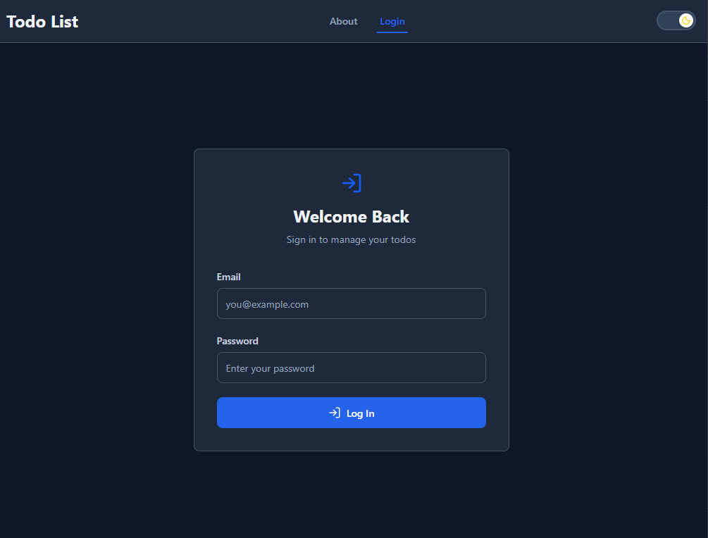
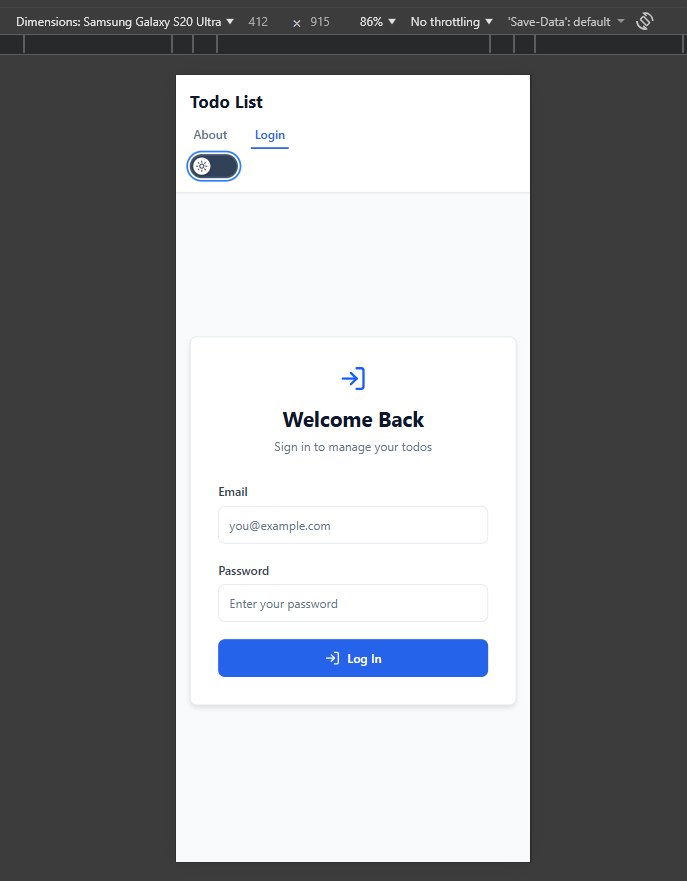
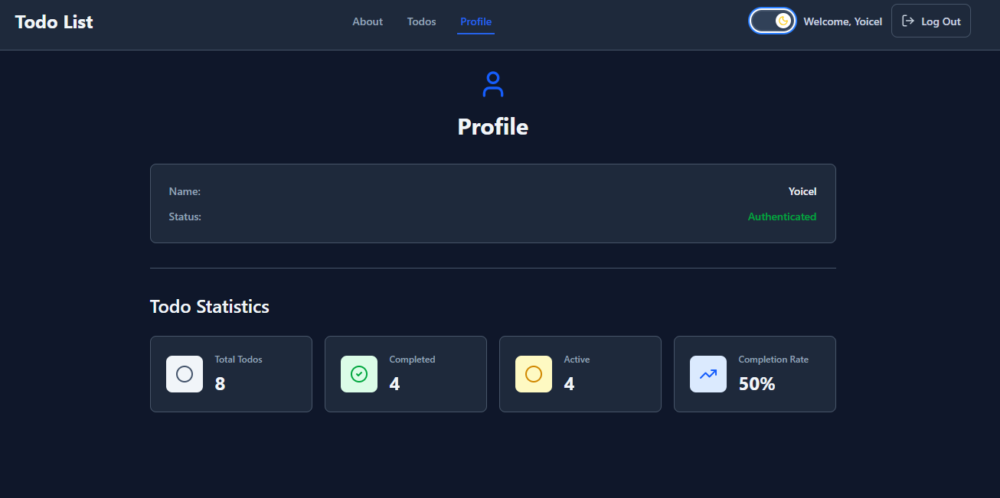
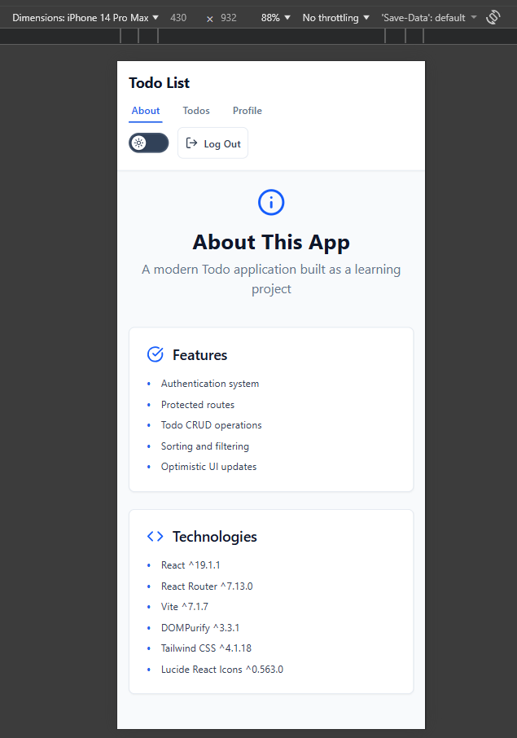
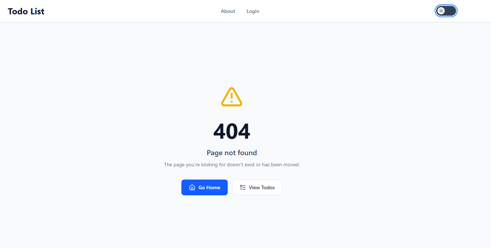
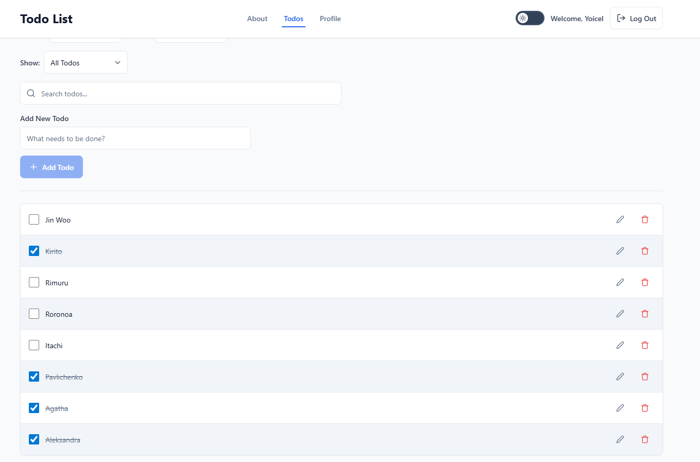
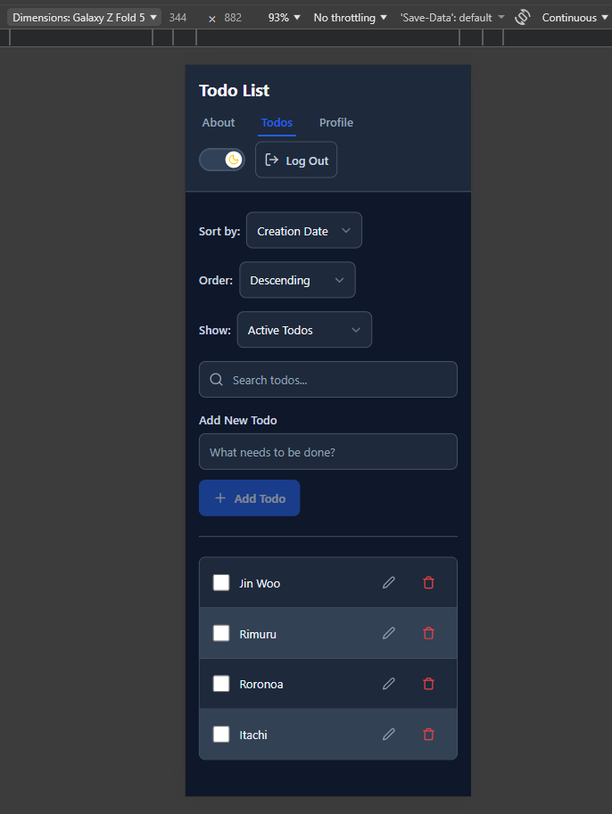
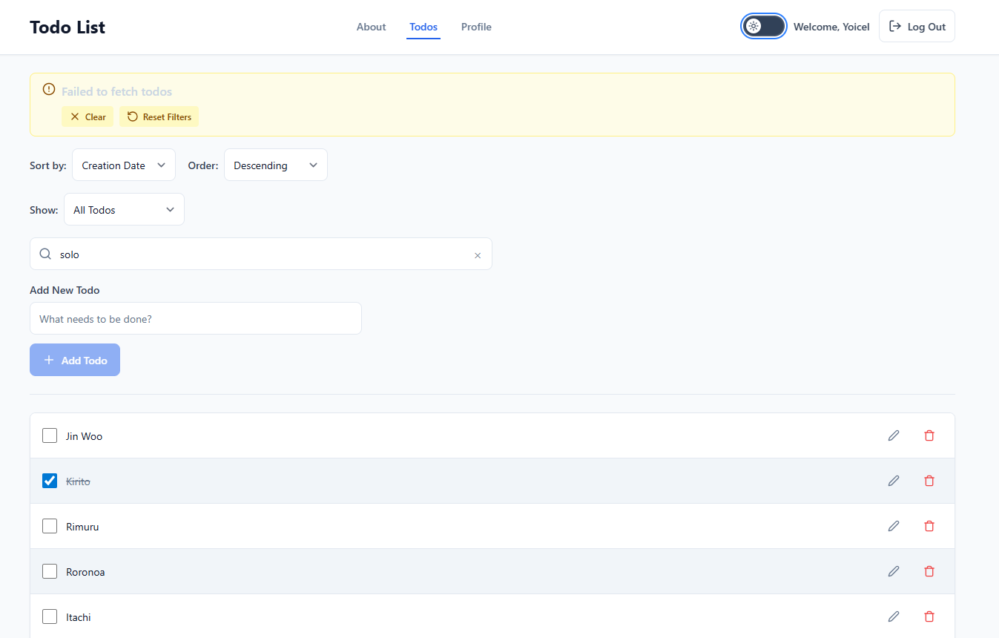
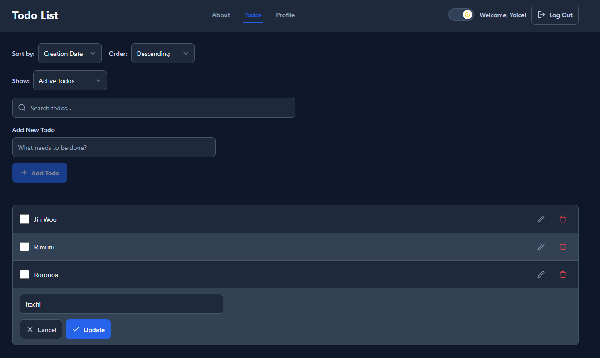
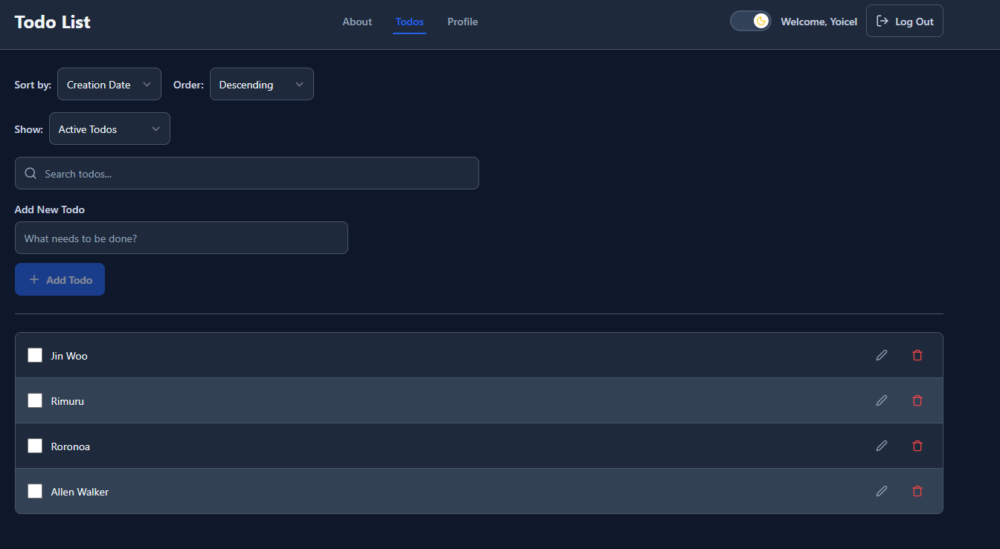

# Todo List Application

A modern, full-featured todo list application built with React, featuring authentication, real-time filtering, and a clean, professional UI.

## Live Demo

[Live Demo](https://todolist-yoicel.onrender.com)

## Features

- **User Authentication** - Secure login/logout system with session management
- **Protected Routes** - Route guards to ensure only authenticated users can access todos
- **Todo CRUD Operations** - Create, read, update, delete and complete todos
- **Dark Mode** - Theme toggle with light/dark preferences, system detection, and localStorage persistence
- **Advanced Filtering** - Search todos by title with real-time debounced updates
- **Flexible Sorting** - Sort by creation date or title, in ascending or descending order
- **Status Filtering** - Filter todos by all, active, or completed status
- **Optimistic UI Updates** - Instant feedback with automatic rollback on errors
- **Input Sanitization** - DOMPurify integration for security against XSS attacks
- **Responsive Design** - Mobile-first approach that works on all devices
- **Loading States** - Clear visual feedback during data fetching
- **Error Handling** - User-friendly error messages with recovery options
- **Empty States** - Helpful messages when no data is available
- **Keyboard Navigation** - Full support for keyboard accessibility with focus indicators
- **Unit Testing** - Comprehensive test suite with Vitest and React Testing Library

## Technologies Used

### Frontend
- **React 19.1.1** - UI library
- **React Router 7.13.0** - Client-side routing with protected routes
- **Vite 7.1.7** - Build tool and development server
- **Tailwind CSS 4.1.18** - Utility-first CSS framework
- **CSS Variables** - Dynamic theming system for dark mode
- **Lucide React 0.563.0** - Modern icon library
- **DOMPurify 3.3.1** - XSS sanitization library

### Development Tools
- **Vitest 4.x** - Unit testing framework
- **React Testing Library** - Component testing utilities
- **ESLint 9.36.0** - Code linting
- **Prettier 3.6.2** - Code formatting
- **PropTypes 15.8.1** - Runtime type checking

## Testing

The project includes a comprehensive unit test suite built with **Vitest** and **React Testing Library**, covering critical business logic and utilities.

### Test Coverage

| File | Tests | Description |
|------|-------|-------------|
| `todoReducers.test.js` | 21 | All reducer action types: fetch, add, complete, update, delete, UI actions, and edge cases |
| `sanitize.test.js` | 22 | XSS prevention, HTML stripping, input type validation for all sanitize functions |
| `todoValidation.test.js` | 6 | Title validation with empty strings, whitespace, and valid inputs |
| `useDebounce.test.js` | 5 | Debounce timing, rapid value changes, and timer reset behavior |
| **Total** | **54** | |

### Running Tests

```bash
# Run all tests once
npm test

# Run tests in watch mode (re-runs on file changes)
npm run test:watch
```

### Testing Approach

- **Pure functions first** - Prioritized testing the reducer and utility functions since they contain the core business logic and are easy to test without mocking
- **Fake timers** - Used Vitest's fake timer API to test debounce behavior deterministically
- **Colocation pattern** - Test files are placed alongside their source files for easy discovery
- **Regression safety** - Tests act as a safety net to catch unintended behavior changes during refactoring

## Screenshots

### Login Dark - Desktop View


### Login Light - Mobile View (Samsung S20 Ultra)


### Profile Dark - Desktop View


### About Light - Mobile View (IPhone 14 Pro Max)


### 404 Not Found Light - Desktop View


### Todo List Light - Desktop View


### Show Actives Dark - Mobile View (Samsung Z Fold 5)


### Failed Fetch - Desktop View


### Edit Dark- Desktop View


### Edit Updated Dark - Desktop View



## Getting Started

### Prerequisites

- **Node.js** (v18 or higher)
- **npm** (v9 or higher)

### Installation

1. Clone the repository:
```bash
git clone https://github.com/jackie3981/todo-list.git
cd todo-list
```

2. Install dependencies:
```bash
npm install
```

3. Create a `.env` file in the root directory:
```env
VITE_BASE_URL=your_api_base_url
```

4. Start the development server:
```bash
npm run dev
```

5. Open your browser and navigate to:
```
http://localhost:3001
```

## Available Scripts

- **`npm run dev`** - Starts the Vite development server on port 3001
- **`npm run build`** - Builds the app for production to the `dist` folder
- **`npm run preview`** - Preview the production build locally
- **`npm test`** - Run the full test suite with Vitest
- **`npm run test:watch`** - Run tests in watch mode
- **`npm run lint`** - Run ESLint to check for code issues
- **`npm run lint:fix`** - Automatically fix ESLint issues where possible
- **`npm run format`** - Format code with Prettier
- **`npm run format:check`** - Check if code is formatted correctly

## Design Decisions

### Styling Approach
It was chose **CSS Modules combined with Tailwind CSS v4** using the `@apply` directive. This approach provides:
- **Scoped styles** - No naming conflicts between components
- **Tailwind utilities** - Consistent design tokens and spacing
- **Clean JSX** - No long className strings cluttering the markup
- **Maintainability** - Styles colocated with components

### Color Palette
The application uses a **professional blue and gray color scheme**:
- **Primary**: Blue 600 (#2563eb) for interactive elements
- **Neutral**: Slate grays for text and backgrounds
- **Semantic colors**: Green for success, red for errors, yellow for warnings

### Dark Mode Implementation
We implemented dark mode using **CSS custom properties (variables)** combined with React Context:
- **ThemeContext** - Manages theme state and localStorage persistence
- **CSS Variables** - Dynamic color tokens that change based on theme (`var(--color-bg-primary)`)
- **System Detection** - Automatically detects user's OS preference (`prefers-color-scheme`)
- **Persistent State** - Theme preference saved in localStorage
- **Toggle Component** - Sun/Moon icon switch in header

### UI/UX Patterns
- **Icons over text** - Used Lucide React icons for Cancel, Update, Edit, Delete, and Search actions for a cleaner, more modern look
- **Alternating rows** - Todo list items alternate between white and light gray backgrounds for better scanability
- **Centered layout** - Content constrained to max-width with consistent alignment
- **Smooth transitions** - 200ms transitions on interactive elements for polished feel
- **Touch-friendly** - All interactive elements meet the 44px minimum touch target size

### Security
- **DOMPurify sanitization** - All user inputs are sanitized to prevent XSS attacks
- **Input validation** - Client-side validation with 200-character limits
- **Type safety** - PropTypes for runtime type checking
- **CSRF protection** - Token-based authentication with the backend API

### Performance
- **Debounced search** - 500ms debounce on filter input to reduce unnecessary API calls
- **Optimistic updates** - Immediate UI feedback with automatic rollback on failure
- **Code splitting** - React Router handles route-based code splitting
- **Memoization** - UseMemo for expensive filtered list computations

## Future Improvements

Given more time, we would add:

- **Drag & drop reordering** - Allow users to manually reorder todos
- **Due dates & reminders** - Add date pickers and notification system
- **Tags & categories** - Organize todos with custom tags
- **Bulk actions** - Select multiple todos for batch operations
- **Todo sharing** - Share todo lists with other users
- **Statistics dashboard** - Visualize productivity trends over time
- **Rich text editor** - Allow formatted descriptions for todos
- **Progressive Web App (PWA)** - Offline support and installable app experience


## License

This project is licensed under the MIT License - see below for details:

```
MIT License

Copyright (c) 2025 Yoicel Rodriguez Martinez

Permission is hereby granted, free of charge, to any person obtaining a copy
of this software and associated documentation files (the "Software"), to deal
in the Software without restriction, including without limitation the rights
to use, copy, modify, merge, publish, distribute, sublicense, and/or sell
copies of the Software, and to permit persons to whom the Software is
furnished to do so, subject to the following conditions:

The above copyright notice and this permission notice shall be included in all
copies or substantial portions of the Software.

THE SOFTWARE IS PROVIDED "AS IS", WITHOUT WARRANTY OF ANY KIND, EXPRESS OR
IMPLIED, INCLUDING BUT NOT LIMITED TO THE WARRANTIES OF MERCHANTABILITY,
FITNESS FOR A PARTICULAR PURPOSE AND NONINFRINGEMENT. IN NO EVENT SHALL THE
AUTHORS OR COPYRIGHT HOLDERS BE LIABLE FOR ANY CLAIM, DAMAGES OR OTHER
LIABILITY, WHETHER IN AN ACTION OF CONTRACT, TORT OR OTHERWISE, ARISING FROM,
OUT OF OR IN CONNECTION WITH THE SOFTWARE OR THE USE OR OTHER DEALINGS IN THE
SOFTWARE.
```

## Contact

**Yoicel Rodriguez Martinez**
- GitHub: [@jackie3981](https://github.com/jackie3981)
